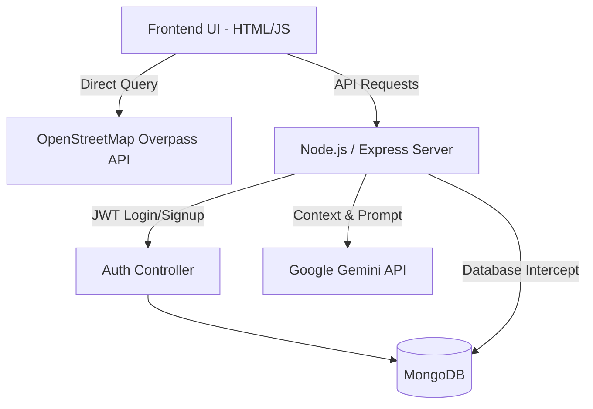
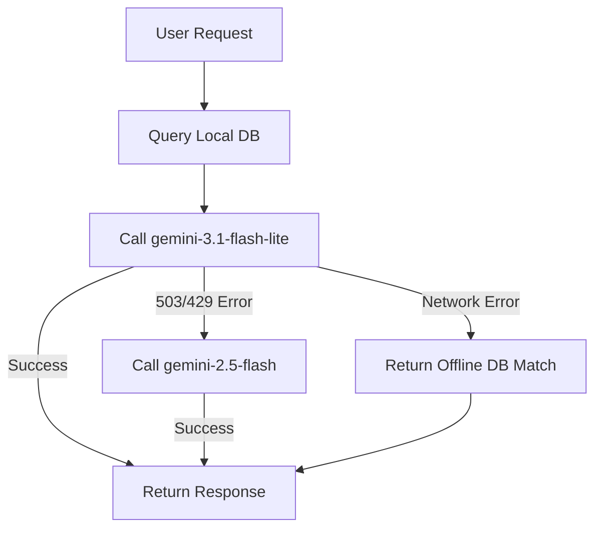

# Salvia - Complete System Workflow & Architecture Analysis

This document provides a highly detailed, deep-dive analysis of the **Salvia -Health Assistant Web Application**. It traces the exact codebase, actual logic execution, and real feature interactions to provide a thesis-ready explanation suitable for technical documentation and viva preparation.

---

## 1. Complete System Overview

### What the Application Does
Salvia 2.0 is an AI-powered health assistant web application. It serves three primary functions:
1. **Conversational AI Health Chatbot**: Answers health queries, provides basic triage, and understands symptom descriptions.
2. **Medication Recognition (OCR)**: Allows users to upload or capture images of medication packaging, which the system analyzes to extract the name, uses, and dosage.
3. **Emergency Hospital Locator**: Automatically or manually detects user location to find nearby healthcare facilities (hospitals, pharmacies, clinics) using OpenStreetMap.

### Main Architecture Style
The system follows a **Monolithic Client-Server Architecture** with hybrid AI capabilities:
- **Frontend**: Vanilla JavaScript, HTML5, CSS3 (Bootstrap 5, Glassmorphism), Leaflet.js.
- **Backend**: Node.js, Express.js.
- **Database**: MongoDB (Mongoose ODM).
- **AI/External Integrations**: Google Gemini API (Chat & Vision), OpenStreetMap (Overpass API for geolocation queries).

### User Interaction Flow
1. User logs in or proceeds as a Guest.
2. User interacts via text or image upload.
3. Frontend packages the request and sends it via REST APIs.
4. Backend intercepts the request, cross-references a local MongoDB database for offline context, and queries the Gemini Cloud AI.
5. AI processes the text/image. If an emergency is detected, it triggers a map function.
6. Backend formats the response and sends it back to the UI.

---

## 2. Complete Codebase Analysis

### File Structure & Responsibilities
- **`server.js`**: The core backend engine. Handles Express configuration, middleware, database connection, Multer file uploads, and the primary `/api/chat` and `/api/identify` AI logic.
- **`public/script.js`**: The main frontend driver. Handles UI state, multiple chat sessions (via `localStorage`), camera modal logic, file uploading, and DOM manipulation.
- **`public/js/chatbot.js`**: Secondary script handling the basic chatbot form interactions, session IDs, and typing indicators.
- **`public/js/map.js`**: Handles Leaflet map initialization, browser Geolocation API, and directly queries the OpenStreetMap Overpass API (`https://overpass-api.de/api/interpreter`).
- **`controllers/authController.js`**: Handles user registration, login, JWT token generation, and password hashing (`bcryptjs`).
- **`middleware/auth.js`**: Verifies JWT tokens. Crucially, it implements a "Guest Mode"—if no token is present, it assigns `req.user = null` and allows the request to proceed.
- **`models/`**: Mongoose schemas for `User`, `FAQ`, and `Medicine`.
- **`config/db.js`**: Establishes the MongoDB connection.
- **`.env`**: Stores sensitive keys (`GEMINI_API_KEY`, `MONGO_URI`, `JWT_SECRET`).

---

## 3. Full Application Workflow

### Trace: User Message Lifecycle
1. **User Input**: User types a symptom (e.g., "I have a headache") in the UI (`script.js`).
2. **Frontend Intercept**: `handleSend()` renders the message immediately locally, activates a typing indicator, and packages the chat history (excluding images).
3. **API Call**: `fetch('/api/chat')` sends the data to the Node.js backend.
4. **Middleware**: `verifyToken` checks for a JWT. If missing, it processes the request as a guest.
5. **Database Intercept**: `server.js` parses the `message`. It runs a Regex query against `FAQ.js` (matching keywords) and `Medicine.js` (matching >3 letter words). 
6. **Prompt Generation**: If a DB match is found, the verified data is injected into Gemini's `SYSTEM_INSTRUCTION` to ensure the AI doesn't contradict official medical data.
7. **AI Cloud Call**: `genAI.getGenerativeModel` calls `gemini-3.1-flash-lite`. It passes the conversation history and a `triggerMapTool` function declaration.
8. **Processing**: Gemini formulates a response. If it detects an emergency, it triggers `trigger_openstreet_maps`.
9. **Backend Formatting**: If the map tool is triggered, the backend appends `ACTION: OPEN_MAP` to the JSON response.
10. **Frontend Rendering**: `script.js` receives the JSON. It updates the DOM, saves the chat to `localStorage`, and if `OPEN_MAP` is true, automatically redirects the user to `/map.html?auto=true&type=hospital` after 5 seconds.

---

## 4. Frontend Workflow

### UI State & LocalStorage
The frontend (`script.js`) maintains complex state without a heavy framework like React. It stores an array of `healthChats` in `localStorage`. 
- When a user sends a message, `saveMessageToCurrentChat()` generates a unique ID, infers a chat title from the first 5 words of the prompt, and pushes it to local storage.
- The sidebar dynamically re-renders using `map()` whenever the state changes.

### Camera & Image Upload Workflow
1. User clicks the Camera button. `script.js` invokes `navigator.mediaDevices.getUserMedia` to access the device's back camera.
2. A `<video>` stream is rendered. Upon capturing, the frame is drawn to a `<canvas>`.
3. The canvas is converted to a binary `Blob` using `.toBlob()`.
4. The `Blob` is appended to a `FormData` object and sent via `fetch('/api/identify')`. This prevents massive Base64 strings from crashing the browser memory.

---

## 5. Backend Workflow

### Express & Request Processing
- **Multer**: The backend uses `multer.diskStorage` to save incoming images temporarily to `public/uploads/` with a timestamped filename.
- **Routing**: API endpoints are handled directly in `server.js` to minimize latency, while Auth routes are delegated to `authRoutes.js`.
- **Resilience**: The backend wraps AI calls in comprehensive `try/catch` blocks. If Gemini throws a `503` (Service Unavailable) or `429` (Rate Limit), the backend explicitly catches it and falls back to a lower-tier model.

---

## 6. AI System Workflow (Hybrid Architecture)

The system uses a highly innovative **Hybrid Offline/Online AI Architecture**.

### The "Database Intercept" Logic
Before Gemini is even queried, the backend scans local MongoDB collections:
```javascript
const allFaqs = await FAQ.find({});
let matchedFaqs = allFaqs.filter(faq => {
    return faq.keywords.some(kw => {
        const regex = new RegExp(`\\b${kw.toLowerCase()}\\b`, 'i');
        return regex.test(userMsg);
    });
});
```
If a match is found, the data is injected into the AI prompt. This heavily reduces AI hallucinations by forcing Gemini to base its response on verified DB data.

### Tiered Fallback Mechanism
If the primary AI model fails due to network issues or rate limits, the system cascades downward:
1. **Tier 1**: `gemini-3.1-flash-lite`
2. **Tier 2**: `gemini-2.5-flash` (triggered on 503/429 errors)
3. **Tier 3**: `gemini-2.5-flash-lite` (Vision only)
4. **Tier 4 (Offline Safety Net)**: If `ENOTFOUND` or `fetch failed` occurs (no internet), the backend immediately returns the local DB query results, allowing the chatbot to function partially completely offline.

---

## 7. OCR & Vision Workflow

1. **Upload**: Image is saved to PC via Multer.
2. **File Reading**: `fs.readFileSync(filePath)` reads the image from the disk.
3. **Base64 Conversion**: The buffer is converted to a base64 string.
4. **AI Generation**: The string and MIME type are passed to Gemini Vision with the prompt: *"Identify this medication. Provide: 1. Name, 2. Primary Uses, 3. General Dosage."*
5. **Dual Response**: The server returns the AI text AND the lightweight local URL (`/uploads/filename.jpg`) so the frontend can render the image quickly without storing massive base64 strings in `localStorage`.

---

## 8. OpenStreetMap Workflow

Google Maps was entirely stripped out in favor of a free, open-source approach:
1. **Geolocation**: `navigator.geolocation.getCurrentPosition()` fetches `lat`/`lng`.
2. **Leaflet Initialization**: `L.map('map')` is instantiated over the user's coordinates.
3. **Overpass QL**: Instead of relying on a backend server to proxy places, the client (`map.js`) dynamically constructs an Overpass Query Language string.
   ```text
   node["amenity"="hospital"](around:15000,lat,lng);
   way["amenity"="hospital"](around:15000,lat,lng);
   ```
4. **Direct API Fetch**: It queries `https://overpass-api.de/api/interpreter` directly, parses the JSON, and generates map markers and routing links (`https://www.openstreetmap.org/directions...`) locally.

---

## 9. Database Workflow

- **Connection**: `config/db.js` uses `mongoose.connect(process.env.MONGO_URI)`.
- **Schemas**: 
  - `User`: Uses `bcryptjs` for password hashing and stores password reset tokens.
  - `Medicine`: Stores structured drug data (Name, Uses, Precautions) for the offline intercept.
  - `FAQ`: Stores Question, Answer, and Keywords for regex matching.
- **Seeding**: The `seed.js` script allows developers to rapidly inject OpenFDA/WHO simulated data into the MongoDB database.

---

## 10. Security Analysis

- **JWT Authentication**: `jsonwebtoken` ensures secure access to protected admin routes.
- **Guest Mode Architecture**: The middleware safely handles missing tokens by assigning `req.user = null`, preventing unauthorized backend crashes.
- **Password Protection**: `bcryptjs` salts (10 rounds) and hashes passwords before they touch the database.
- **Input Sanitization**: Frontend DOM generation uses `textContent` instead of `innerHTML` for user messages to explicitly prevent Cross-Site Scripting (XSS) attacks.

---

## 11. Scalability Analysis

- **Current Bottlenecks**: Multer saving images to local disk (`public/uploads/`) will fill up storage on a scalable server like Heroku. 
- **Optimization Strategy**: To scale, `multer.diskStorage` should be swapped for `multer.memoryStorage()`, directly streaming the buffer to Gemini or an AWS S3 bucket.
- **Database Scaling**: The FAQ regex search scans the whole collection. In production, this should be replaced with MongoDB Atlas Full-Text Search or Redis caching.

---

## 12. Visual Outputs (Mermaid Diagrams)

### System Architecture


### AI Fallback Flow Diagram


---

## 13. Viva Preparation & Q&A

**Q: Why did you choose Google Gemini over Dialogflow?**
A: Dialogflow is primarily focused on strict intent matching and pre-defined conversational trees. By migrating to Gemini, the application gained Generative capabilities, allowing it to dynamically handle complex medical queries and perform OCR (Image Vision) within the same API ecosystem.

**Q: How does your system work offline?**
A: We implemented an innovative "Database Intercept" layer. When a user sends a message, the backend immediately searches our local MongoDB `FAQ` and `Medicine` collections. If the Wi-Fi drops and the `fetch` to Gemini fails (`ENOTFOUND`), a `catch` block captures the error and returns the data retrieved from the local database instead.

**Q: How did you implement the nearby hospital locator without Google Maps API?**
A: We completely decentralized the map logic. The frontend uses the browser's Geolocation API to get coordinates. It then constructs an Overpass Query Language (QL) script and sends a POST request directly to the public OpenStreetMap Overpass API (`overpass-api.de`). The results are plotted using Leaflet.js. This eliminates backend bottlenecking and removes the need for paid API keys.

**Q: How is image uploading handled securely without crashing the browser?**
A: Instead of converting images to massive Base64 strings on the frontend (which causes memory leaks), we draw the camera stream to a `<canvas>`, convert it to a binary `Blob`, and append it to `FormData`. On the backend, `multer` writes it to disk, and the server reads the file buffer to send to Gemini.

